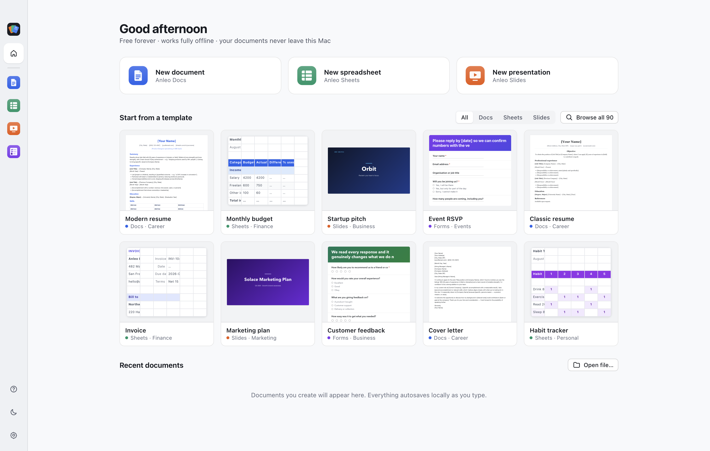
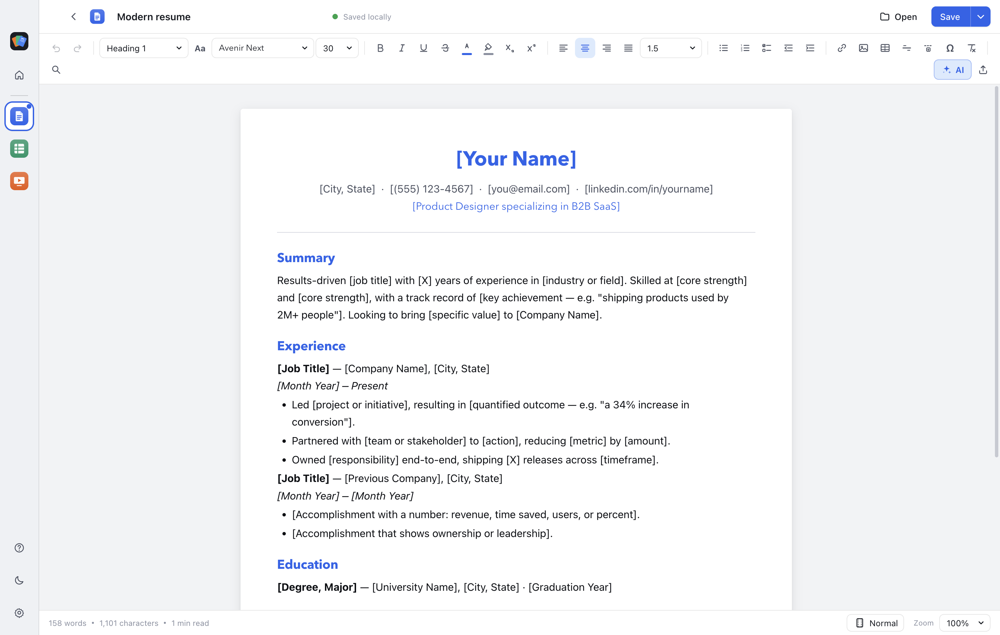
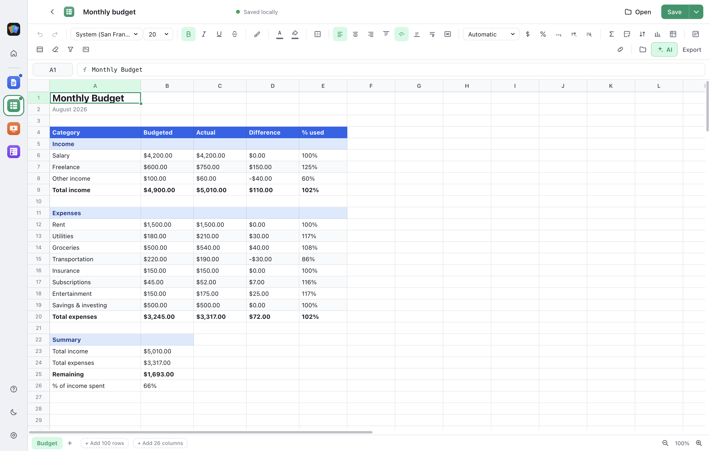
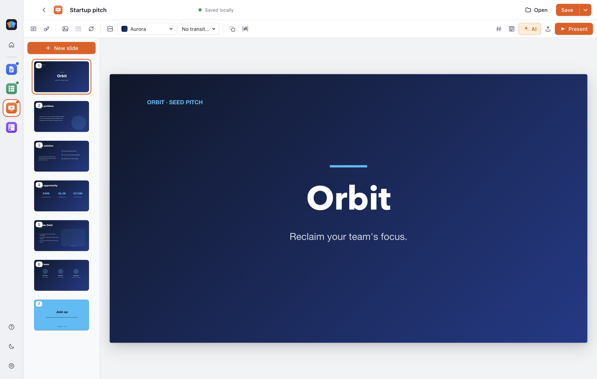

<div align="center">

# Anleo Office

**Documents, spreadsheets and presentations in one Mac app.**
Free, open source, and completely offline — it makes no network requests at all.

[](LICENSE)


</div>



---

Anleo is one application, not three downloads. There is no account, no
subscription, no cloud, no telemetry and nothing to sign up for. Your documents
are files on your Mac and they stay there.

It is free because it costs nothing to run: there is no server anywhere.

## Contents

- [The three apps](#the-three-apps)
- [Why it's private](#why-its-private)
- [Things Word and Google Docs don't do](#things-word-and-google-docs-dont-do)
- [Install](#install)
- [Build from source](#build-from-source)
- [Development](#development)
- [Contributing](#contributing)

---

## The three apps

### Anleo Docs



A word processor with the formatting you actually use: styles, tables, lists,
find and replace, page breaks, a table of contents, special characters, and
system spellcheck with right-click suggestions.

Two things it does better than Word:

- **Images you can genuinely move.** Drag a picture anywhere on the page and
  the text flows around it — left wrap, right wrap or inline — without the
  layout collapsing. It exports as a real Word square-wrap anchor, so it
  survives the round trip.
- **Install your own fonts** by dropping a `.ttf`/`.otf` into the app. No
  system installation, no admin password.

Exports to **docx, pdf, odt, rtf, epub, html, md and txt**. Imports docx, md,
html and txt.

### Anleo Sheets



A spreadsheet with a real formula engine — around 135 Excel-compatible
functions, written from scratch: lookup (`XLOOKUP`, `INDEX`/`MATCH`),
multi-criteria (`SUMIFS`, `COUNTIFS`, `MAXIFS`), financial (`PMT`, `NPV`,
`IRR`, `RATE`), statistics (`PERCENTILE`, `CORREL`, `FORECAST`) and the full
date toolkit (`EDATE`, `NETWORKDAYS`, `DATEDIF`).

Plus merged cells, freeze panes, conditional formatting with colour scales,
data validation dropdowns, column filters, charts, multi-sheet workbooks, and
xlsx/csv in both directions.

### Anleo Slides



Themes, layouts, 15 shape types with gradient fills and arrowheads, align and
distribute, transitions, slide numbers, speaker notes, and a presenter view
with notes and a timer. Exports to pptx and PDF.

### 80 templates

Résumés, invoices, budgets, pitch decks, lesson plans, habit trackers and
newsletters — searchable and filterable, across all three apps.

---

## Why it's private

Most office software is chatty. It checks for updates, reports crashes, syncs
settings, and cheerfully loads whatever a document asks it to. If you handle
material that other people would like to read, that is a problem.

Anleo makes **no network requests**. Not fewer — none.

That is enforced rather than intended. A deny-by-default filter in the main
process cancels every request that is not a local file, sitting *below* the
renderer, so it holds even if the user interface is compromised. A strict
Content-Security-Policy is a second, independent layer.

**A document you open cannot tell anyone you opened it.** The oldest trick
against a reporter is a one-pixel image hosted on the sender's server: open the
file and they learn your IP address and the moment you read it. Word does this
by default. Anleo strips remote images, scripts, iframes, remote stylesheets and
`javascript:` links out of every file it imports — and tells you what it
removed.

Links show you the real destination and ask before opening. Exported web pages
are inert and self-contained. PDF scratch files are shredded.

**AI is optional and off by default.** There is no bundled key. Add your own
OpenRouter key and exactly one host opens in the gate; remove it and the app
goes back to reaching nothing. Settings → Privacy shows the live state.

### Check it yourself

```bash
npm run verify:security
```

34 assertions inside a real Electron process — genuine connection attempts to
outside hosts, asserted to fail. `npm run dist` refuses to build if any fail.

> **Read [PRIVACY.md](PRIVACY.md) before relying on this for anything that
> matters.** It is explicit about the limits: your documents are **not**
> encrypted on disk, this does not protect a compromised Mac, it does not make
> you anonymous, and there is no auto-update — which means security fixes will
> not reach you on their own.

---

## Things Word and Google Docs don't do

**Live links between the three apps.** Copy a range in Sheets, paste it into a
document or a slide, and it stays connected. Change the spreadsheet, hit
refresh, and the table and its totals update wherever you pasted them. No cloud
involved — it is all local.

**Share as a web page.** Turn any document into a single `.html` file that
anyone can open by double-clicking, on Mac, Windows or a phone. No app to
install, no account, no internet. Spreadsheets stay live and recalculate for
the reader, decks play as a slideshow, checklists stay tickable.

**Command palette.** `⌘K` searches and runs every command in the app; `⌘/`
lists them all with their shortcuts.

**Optional AI.** Rewrite, summarise, change tone, generate a formula from a
description, or draft a deck outline — with your own OpenRouter key and the
model you choose.

---

## Install

Download the `.dmg` from [Releases](https://github.com/BradB808/ARELO-Office-Suite-/releases)
and drag Anleo Office to Applications. Universal binary: Intel and Apple
Silicon.

Builds are deliberately **unsigned** — signing would stamp a real person's
legal name and Apple Team ID into every binary, which is the wrong trade for
this particular app ([why](SECURITY.md#why-the-default-build-is-unsigned)).
The cost is that macOS refuses it on first launch. Right-click the app →
**Open** → **Open**, or:

```bash
xattr -dr com.apple.quarantine "/Applications/Anleo Office.app"
```

If you would rather not trust a binary downloaded from the internet — a
reasonable position for this particular app — build it yourself.

## Build from source

Requires Node 20 or newer.

```bash
git clone https://github.com/BradB808/ARELO-Office-Suite-.git
cd ARELO-Office-Suite-
npm install
npm run dist
```

The universal `.dmg` lands in `release/`. `npm run dist` runs the security
checks first and stops if any fail, so a build that produced a DMG is a build
that passed them.

## Development

```bash
npm run dev            # Vite dev server on :5173
npm run dev:electron   # Electron against the dev server (separate terminal)
npm run typecheck      # tsc --noEmit
npm run verify:security
npm run screenshots    # regenerate docs/screenshots from the running app
npm run dist           # universal DMG, unsigned
npm run dist:signed    # only if you intend your Developer ID in the binary
```

### Tests

| Suite | Assertions | Run |
|---|---|---|
| Formula engine | 260 | `npx vite build --ssr src/apps/sheets/engine/formula.test.ts --outDir .tmp && node .tmp/formula.test.js` |
| Document conversion | 94 | `npx vite build --ssr src/apps/docs/convert/convert.test.ts --outDir .tmp && node .tmp/convert.test.js` |
| Shared contracts | 63 | `npx vite build --ssr src/shared/shared.test.ts --outDir .tmp && node .tmp/shared.test.js` |
| Security layer | 34 | `npm run verify:security` |
| Import sanitizer | 55 | `npm run dev`, then <http://localhost:5173/security-test.html> |

### Layout

```
electron/       main process — window, IPC, security
  security.cjs    network gate, navigation guards, secret storage
src/
  apps/docs/      TipTap editor, import/export, floating images
  apps/sheets/    grid, formula engine (tokenizer → parser → evaluator)
  apps/slides/    canvas editor, present mode, pptx export
  shared/         cross-app: AI, live links, sanitizer, theming, exports
  shell/          command palette, shortcuts help
  templates/      the 80 templates
scripts/        icon generation, security checks, screenshots
```

### Stack

Electron 43 · React 19 · TypeScript (strict) · Vite 8 · TipTap 3 · SheetJS ·
docx · pptxgenjs. No runtime services of any kind.

## Contributing

Issues and pull requests are welcome. Two things to know:

- **The privacy properties are the point.** A change that adds a network
  request, a remote asset, a font from a CDN or an analytics call will not be
  merged, however convenient. `npm run verify:security` must stay green.
- Run `npm run typecheck` and the test suites before opening a PR.

See [FEATURES.md](FEATURES.md) for the parity audit against Excel, Word and
PowerPoint, including what is deliberately out of scope.

## License

[MIT](LICENSE)
